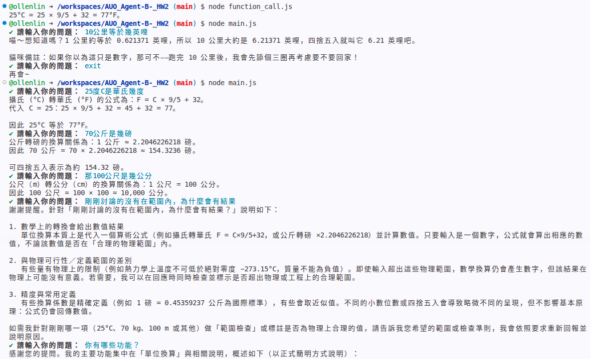
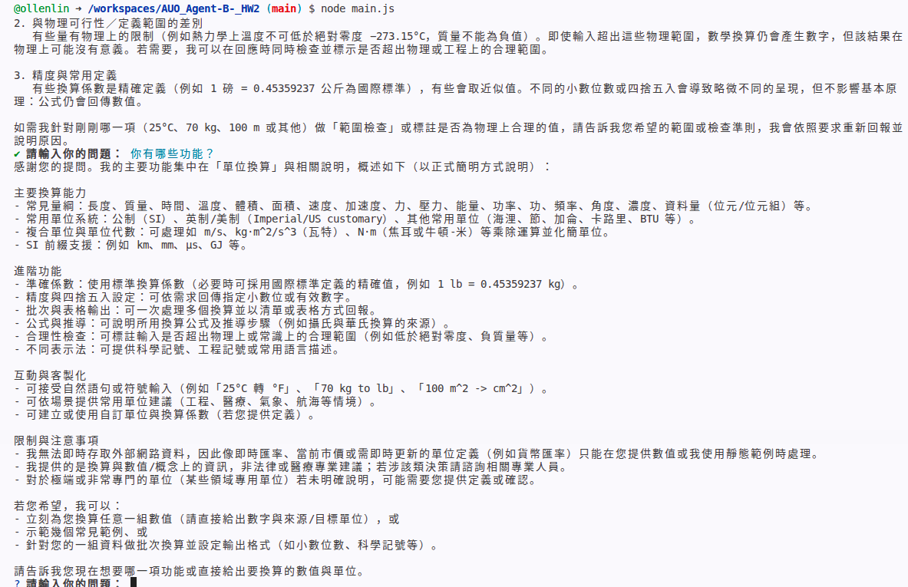

# 作業 2：新增 Function Calling 單位換算工具

## 1. 任務說明

本作業參考課程中的天氣工具範例，新增一個 Function Calling 工具：

```text
convert_unit
```

此工具可讓 AI 根據使用者輸入，自動呼叫單位換算函式，完成基本單位轉換。

本作業選擇「單位換算」作為工具主題，原因是：

* 不需要外部 API
* 邏輯簡單，容易驗證結果
* 適合練習 Function Calling 流程
* 可練習定義多個參數的 JSON Schema

---

## 2. 工具功能

### 工具名稱

```text
convert_unit
```

### 工具描述

```text
進行單位換算
```

### 支援換算項目

本工具支援以下三組單位換算：

| 類型 | 支援換算    | 換算公式                 |
| -- | ------- | -------------------- |
| 溫度 | 攝氏 ↔ 華氏 | °F = °C × 9/5 + 32   |
| 長度 | 公里 ↔ 英里 | 1 km = 0.621371 mile |
| 重量 | 公斤 ↔ 磅  | 1 kg = 2.20462 lb    |

---

## 3. JSON Schema 定義

本工具使用 Function Calling 的 JSON Schema 定義三個參數：

```js
{
  value: "要換算的數值，例如 25、10、70",
  from_unit: "原始單位，例如 C、攝氏、km、公斤",
  to_unit: "目標單位，例如 F、華氏、mile、磅"
}
```

完整工具 schema 範例：

```js
export const convertUnitTool = {
  type: "function",
  function: {
    name: "convert_unit",
    description: "進行單位換算，支援攝氏與華氏、公里與英里、公斤與磅之間的換算。",
    parameters: {
      type: "object",
      properties: {
        value: {
          type: "number",
          description: "要換算的數值，例如 25、10、70",
        },
        from_unit: {
          type: "string",
          description: "原始單位，例如 攝氏、華氏、C、F、公里、km、英里、mile、公斤、kg、磅、lb",
        },
        to_unit: {
          type: "string",
          description: "目標單位，例如 攝氏、華氏、C、F、公里、km、英里、mile、公斤、kg、磅、lb",
        },
      },
      required: ["value", "from_unit", "to_unit"],
    },
  },
};


## 4. 執行結果展示

### 結果一



---

### 結果二



